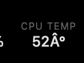

# Comma4-UI-Streamer

Stream your comma 4's live sunnypilot/openpilot UI to any browser on your local network via WebRTC (H.264 preferred).

> Forked from [Comma4-UI-Streamer](https://github.com/peterclampton/Comma4-UI-Streamer) by [peterclampton](https://github.com/peterclampton). Original project provided MJPEG streaming of the comma UI. This fork replaces MJPEG with WebRTC (H.264 preferred), adds a real-time telemetry overlay via SSE, PWA support, and a zero-patch install architecture.

  



## What you get

Open `http://<comma-ip>:8082` on your phone, infotainment screen, or any browser — and see the comma UI live with full HUD overlay (lane lines, lead car, speed, alerts) plus real-time telemetry data. Video is delivered via WebRTC with H.264 codec preference for low-latency, bandwidth-efficient streaming.

**Live overlay includes:**
- Set speed, speed limit (from map data), engage status (Engaged / Standby / Steering with sunnypilot MADS)
- Lead car distance (ft) and gap time (seconds) — appears when a lead car is detected and self-driving is active
- Acceleration bar, gas/brake output
- Road grade (%)
- Performance monitoring — model exec time, frame drops, CPU temperature, CPU usage & memory usage

**Endpoints:**
- `/` — fullscreen viewer with telemetry overlay (WebRTC video)
- `/offer` — WebRTC signaling (POST SDP offer, receive SDP answer)
- `/telemetry/stream` — Server-Sent Events (SSE) telemetry stream
- `/telemetry` — one-shot telemetry JSON (for debugging / curl)
- `/snapshot` — grab a single JPEG frame
- `/health` — JSON status (frame availability, resolution, timestamp)

---

## Requirements

Your phone/browser must be on the **same wifi network** as your comma (or connected via USB tether). A modern browser with WebRTC support is required (Chrome, Firefox, Safari, Edge).

## Setup

### Step 1 — SSH into your comma

```bash
ssh comma@<your-comma-ip>
```

### Step 2 — Install and enable

```bash
# Download the installer
curl -fsSL https://raw.githubusercontent.com/Scotty-Hudson/Ccomma4-UI-Streamer-h264/main/ensure_stream.sh -o /data/ensure_stream.sh
chmod +x /data/ensure_stream.sh

# Run it (installs stream files + Python hook + boot service)
sudo /data/ensure_stream.sh

# Reboot to activate
sudo reboot
```

Then open in your browser:

```
http://<comma-ip>:8082
```

### What the installer does

`ensure_stream.sh` handles everything in one shot:

1. **Stream files** — downloads `ui_stream.py`, `ui_frame_bridge.py`, and `stream_hook.py` to `/data/`
2. **Python hook** — installs a `.pth` file in Python's site-packages that loads the stream hook at startup
3. **Boot service** — installs a systemd service that re-runs on every boot, **before** openpilot starts

**No openpilot files are modified.** The hook monkeypatches `GuiApplication` at import time, so the stream survives git resets, overlay swaps, and sunnypilot updates automatically.

### After an AGNOS update

AGNOS updates (rare — a few times a year) may wipe the `.pth` file and systemd service. Just re-run:

```bash
sudo /data/ensure_stream.sh
```

---

## Mobile — Add to Home Screen

Works best on phones and tablets when added as a web app. This gives you a fullscreen, app-like experience with no browser bar.

**iOS (Safari):**
1. Open `http://<comma-ip>:8082` in Safari
2. Tap the **Share** button (square with arrow)
3. Scroll down and tap **Add to Home Screen**
4. Tap **Add**

**Android (Chrome):**
1. Open `http://<comma-ip>:8082` in Chrome
2. Tap the **⋮** menu (top right)
3. Tap **Add to Home Screen**
4. Tap **Add**

> **Note:** Chrome's "Install app" option requires HTTPS, which isn't available on a local network device. Use **Add to Home Screen** instead — it works the same way.

The stream will now open as a standalone app — no browser bar, no tabs, just the live UI.

---

## Configuration

Set these environment variables before openpilot starts (e.g., in `launch_env.sh`):

| Variable | Default | Description |
|----------|---------|-------------|
| `STREAM_PORT` | `8082` | HTTP port for the stream server |
| `STREAM_FPS` | `10` | Target capture/stream frame rate |

Example:

```bash
export STREAM_PORT=8082
export STREAM_FPS=10
```

The stream activates automatically when `/data/ui_stream.py` exists — no `STREAM=1` env var needed.

---

## How it works

A `.pth` file in Python's site-packages directory loads `stream_hook.py` at Python startup. When the UI process imports `openpilot.system.ui.lib.application`, the hook intercepts the import via `sys.meta_path` and monkeypatches `GuiApplication`:

1. **`init_window`** is wrapped to start the WebRTC server after the window initializes
2. **`_monitor_fps`** is wrapped to capture the render texture as an RGB frame each tick
3. Frames are published to a shared buffer (`ui_frame_bridge.py`) consumed by the WebRTC video track

When a browser connects, it negotiates a WebRTC peer connection via the `/offer` endpoint. Both the SDP answer and codec preferences are set to prefer H.264, giving you hardware-friendly, low-latency video with minimal bandwidth. The telemetry overlay receives live vehicle and system data via Server-Sent Events (SSE) — a persistent connection that pushes updates as they arrive, with no polling overhead.

**No openpilot source files are modified.** Everything lives in `/data/` and the Python site-packages `.pth` file, both of which persist across git resets and overlay swaps.

---

## Troubleshooting

**Connection refused on :8082**
- Check the stream files exist: `ls -la /data/ui_stream.py /data/ui_frame_bridge.py /data/stream_hook.py`
- Check the .pth file exists: `ls -la $(python3 -c "import site; print(site.getsitepackages()[0])")/comma_stream.pth`
- Check port is listening: `ss -tlnp | grep 8082`
- Check health endpoint: `curl http://localhost:8082/health`

**Stream connects but blank/no frames**
- The render texture may not be initializing. Check `/health` — `has_frame` should be `true`
- Check logs: `journalctl -n 50 | grep -i stream`

**After sunnypilot update, stream stopped**
- Run `sudo /data/ensure_stream.sh` and reboot. The boot service should do this automatically, but if it's missing after an AGNOS update, this restores it.

---

## Uninstall

```bash
# Remove the stream files
rm -f /data/ui_stream.py /data/ui_frame_bridge.py /data/stream_hook.py /data/stream_patch.py /data/ensure_stream.sh

# Remove the .pth file
SITE=$(python3 -c "import site; print(site.getsitepackages()[0])")
sudo mount -o remount,rw /
sudo rm -f "$SITE/comma_stream.pth"

# Remove the boot service
sudo systemctl disable ensure-stream.service
sudo rm -f /etc/systemd/system/ensure-stream.service
sudo systemctl daemon-reload

sudo reboot
```

---

## Compatibility

- **Hardware:** comma 4 (Snapdragon 845)
- **Software:** sunnypilot and openpilot — both use the same `pyray`-based UI framework
- **Browsers:** Safari (iOS), Chrome, Firefox, Edge — any browser with WebRTC support

## Tested on

- comma 4
- sunnypilot staging + dev (March 2026)
- 2017 Lexus RX350 (TSS-P)

## Credits

- **[peterclampton](https://github.com/peterclampton)** — original [Comma4-UI-Streamer](https://github.com/peterclampton/Comma4-UI-Streamer) project

## License

MIT
